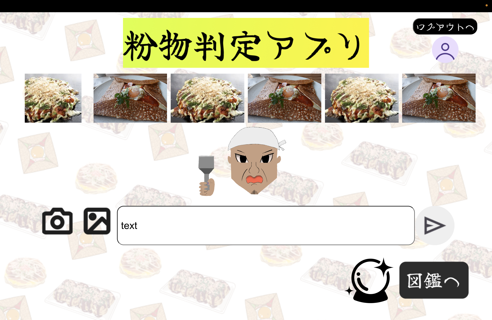

# プロダクト名
粉物マスター(鉄平ちゃん)
<!-- プロダクト名に変更してください -->

<!-- プロダクト名・イメージ画像を差し変えてください -->

## チーム名
チーム14 そば粉のgalette
<!-- チームIDとチーム名を入力してください -->

## 背景・課題・解決されること
###「関西をいい感じに」への取り組み
私たちのチーム「そば粉のgalette」は、関西の象徴的な食文化である「粉物」に着目しました。チームで話し合いを重ねる中で、関西といえばお好み焼きやたこ焼きといった粉物料理が浮かびました。そして、AIを活用して「どんな画像やテキストでも意地でも粉物と判定するアプリ」を開発するアイデアに至りました。奇しくも、チーム名である「そば粉のgalette」自体も粉物料理であり、まさに私たちにぴったりのプロジェクトだと感じました。

### 課題と解決策
#### 課題:
関西の粉物文化は広く知られていますが、そのユニークさや魅力を新しい形で発信する方法が少ないと感じました。また、AI技術を使って遊び心のある体験を提供し、粉物をより身近に感じてもらう手段があまりありませんでした。

#### 解決策:
そこで、私たちはAIを活用し、与えられたテキストや画像に対して「強引にでも粉物と判定する」アプリを開発しました。このアプリを通じて、関西の粉物文化を楽しみながら体験できるユニークなコンテンツを提供します。

### 開発の挑戦と努力
#### フロントエンド:
JavaScriptを初めて扱うメンバーが多く、Reactの記述に苦戦しましたが、ChatGPTなどのAIツールを活用しながら学習し、実装を進めました。
さまざまなデバイスで快適に利用できるよう、レスポンシブデザインにこだわり、CSSの調整に力を入れました。
#### バックエンド:
初期の開発は順調でしたが、フロントエンドとの通信において、Cookieの扱いやCORS設定で問題が発生しました。
しかし、試行錯誤を重ねた結果、適切な設定を行うことができ、スムーズな通信を実現しました。
### まとめ
このプロジェクトを通じて、関西の粉物文化の面白さを発信しつつ、技術的な挑戦にも取り組みました。遊び心のあるアプリを通して、多くの人に粉物の魅力を感じてもらえることを期待しています。
<!-- テーマ「関西をいい感じに」に対して、考案するプロダクトがどういった(Why)背景から思いついたのか、どのよう(What)な課題があり、どのよう(How)に解決するのかを入力してください -->

## プロダクト説明
ホーム画面で画像またはテキストを入力すると、「鉄平ちゃん」がそれがどのような粉物かを説明してくれます。
また、事前にホーム画面からログインしておくことで、入力した画像やテキストを保存することが可能です。画像またはテキストを入力した後、「図鑑に登録」をクリックす
ると、その内容が保存されます。
さらに、図鑑ボタンをクリックすると、これまでに保存した画像の一覧が表示され、任意の画像をクリックすると、保存された画像とテキストが表示されます。
<!-- 開発したプロダクトの説明を入力してください -->

## 操作説明・デモ動画
[デモ動画はこちら](https://www.youtube.com/watch?v=fbzGp0XJGq8)
<!-- 開発したプロダクトの操作説明について入力してください。また、操作説明デモ動画があれば、埋め込みやリンクを記載してください -->

## 注力したポイント
<!-- 開発したプロダクトの中で、特に注力して作成した箇所・ポイントについて入力してください -->
### アイデア面
グループで話し合った際、関西の食や観光、関西弁に関するアイデアが多く出ました。しかし、他のグループと被る可能性があり、それを避けるために、人とかぶらないユニークなアイデアを考えるのに苦労しました。
### デザイン面
パソコンだけでなくスマホにも対応させたかったため、CSSを活用してレスポンシブ対応に注力しました。
<!-- ### その他 -->

## 使用技術
フロントエンド:React
バックエンド:Gemini,Flask
データベース:SQLAlchemy
その他:Figma,Github,Docker
<!-- 使用技術を入力してください -->

<!--
markdownの記法はこちらを参照してください！
https://docs.github.com/ja/get-started/writing-on-github/getting-started-with-writing-and-formatting-on-github/basic-writing-and-formatting-syntax
-->
